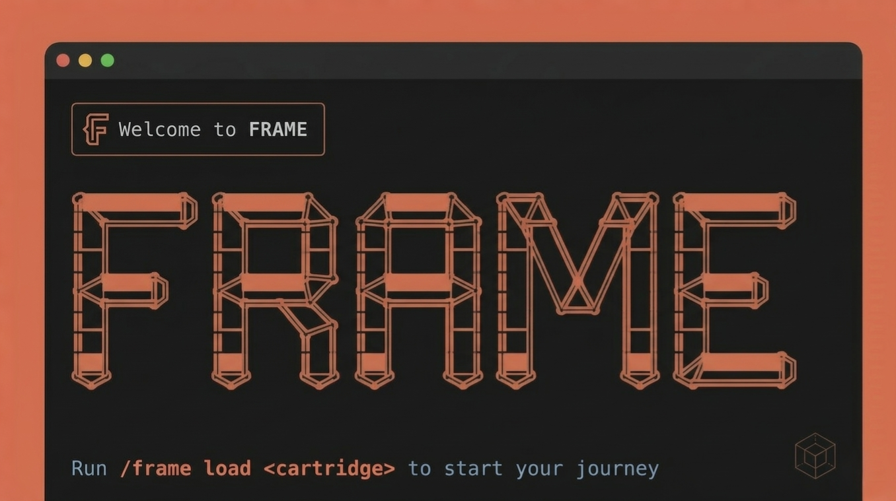

# FRAME — Flexible Role-Adaptive Modular Engine




A prompt-native workflow engine for Claude Code. FRAME guides AI sessions through structured, role-switched workflows using swappable domain cartridges — with no tooling overhead, no multi-agent complexity, and no file sprawl.

---
[](https://youtu.be/PMo5p-Ay0BI)

*Demo - watch on YouTube: skill-creation cartridge building a Jira CLI skill from scratch.*


---

## What it does

FRAME turns a Claude Code session into a structured process. Instead of a freeform conversation, you get:

- **Phases** — defined stages of work (shape the problem, break it down, design, build, check)
- **Roles** — Claude adopts the right role at each phase (Requirements Engineer, Architect, Developer, Reviewer)
- **Gates** — explicit checkpoints between phases; nothing advances without your confirmation
- **Cartridges** — domain-specific phase sequences and roles, swappable without touching the engine

A session looks like this:

```
/frame load sw-development
```

FRAME then guides you from requirements through architecture, implementation, and review — one unit at a time, with full state persistence across `/clear`.

---

## Design principles

- **Prompt-native** — lives entirely in Claude Code conventions; zero tooling overhead
- **Token-lean** — no verbose narration, compressed summaries, no redundant preamble
- **Single-thread** — one role active at a time; no multi-agent orchestration
- **Minimal artifact set** — `PROJECT.md`, `BREAKDOWN.md`, `SESSION.md`, and phase archives in `.frame/archive/` — nothing more
- **Domain-agnostic core** — cartridges define the domain; the engine stays neutral

---

## Included cartridges

| Cartridge | Domain | Output |
|---|---|---|
| `sw-development` | Software development — APIs, services, features | Working code, test suite |
| `sw-development-tdd` | TDD-first software development — test list before implementation | Working code, passing test suite |
| `sw-development-cd` | UI/frontend development — Claude Design prototype to production | Working production app, deployed |
| `deploy` | Software deployment — VPS, cloud, containerised, serverless | Deployment log, verification report, incident summary |
| `blog-writing` | Blog posts, articles, essays | Publishable draft |
| `linkedin-profile` | LinkedIn profile authorship from a CV | Publish-ready profile sections |
| `code-audit` | Code audit — quality/architecture review, security audit, or both | Prioritised findings report |
| `codebase-analysis` | Structural analysis of an existing codebase | Report set + `ADVICE.md` |
| `project-planner` | Project planning — backlog generation and milestone structuring | `BACKLOG.md` with prioritised work items |
| `findings-to-tasks` | Turn audit or analysis findings into tracked tasks | Tasks in Jira, Linear, or similar |
| `document-and-commit` | Document and commit code changes made outside of FRAME | Commit message, changelog entry, doc updates |
| `skill-creation` | Build a new Claude Code skill | Ready-to-install skill file |
| `cartridge-creator` | FRAME cartridge authorship | New or modified cartridge |

FRAME is the platform; cartridges are the product. Session quality scales with cartridge quality — the included cartridges are the validated baseline. Custom cartridges are fully supported via `cartridge-creator`.

---

## Installation

```bash
git clone https://github.com/SeriousByDesign/frame.git
cd frame
bash install.sh           # interactive — prompts before overwriting
bash install.sh --force   # overwrite everything, no prompts
```

This copies the engine to `~/.claude/commands/frame.md` and the cartridge library to `~/.frame/cartridges/`. Requires Claude Code.

Windows: run via Git Bash (ships with Git for Windows) or WSL (Windows Subsystem for Linux). Alternatively, copy `engine/frame.md` to `%USERPROFILE%\.claude\commands\frame.md` and cartridge folders to `%USERPROFILE%\.frame\cartridges\` manually.

**Git is optional.** FRAME prompts to initialise a repo at load time — choose `skip` or `never` to proceed without one. All state files are still written to `.frame/` throughout the session, so the full process record is preserved. What you lose is versioned history: the ability to diff between phases, roll back to a prior checkpoint, or see a timeline of changes.

---

## Quick start

**1. Install**
```bash
git clone https://github.com/SeriousByDesign/frame.git
cd frame
bash install.sh
```

**2. Load a cartridge in your project**

Open a Claude Code session in your project directory, then:
```
/frame load sw-development
```
FRAME reads your project directory, adopts the Requirements Engineer role, and opens SHAPE — a focused set of questions about your goal, stack, constraints, and exclusions. If the cartridge supports express mode, you'll be asked to choose between `express` and `full` before SHAPE begins.

**3. Answer the SHAPE questions**

Respond as you would to a senior engineer onboarding to your project. FRAME produces a `PROJECT.md` summary at the end of SHAPE for you to confirm.

**4. Confirm the gate**

At the end of each phase, FRAME presents a summary and asks:
```
→ Advance to BREAKDOWN? (y / adjust / pause)
```
`y` advances. `adjust` keeps you in the current phase. `pause` writes state and stops — safe to `/clear`.

After BREAKDOWN, FRAME works through DESIGN, BUILD, and CHECK — one unit at a time, one role at a time.

---

**Commands:**
```
/frame list                        # see available cartridges
/frame load <cartridge>            # start a session
/frame resume                      # restore after /clear
/frame status                      # check current state
/frame stop                        # stop cleanly, safe to /clear
```

---

## Long sessions

FRAME writes state to file at every gate and unit boundary — `PROJECT.md`, `BREAKDOWN.md`, `SESSION.md`, and phase archives are always current. Every gate message includes a reminder that it's safe to `/clear`.

When context gets long:

```
/frame stop        # or just /clear directly — state is already saved
/clear
/frame resume      # picks up exactly where you left off
```

No work is lost. The resume cycle is a designed workflow, not an emergency.

---

## Autonomous runs

FRAME is interactive by default — it stops at every gate for confirmation. For well-defined tasks where you trust the model's judgment, you can run a session fully autonomously.

Start Claude Code without permission prompts:

```bash
claude --dangerously-skip-permissions
```

Then load a cartridge with an autonomous instruction upfront. The context block mirrors what SHAPE would extract — give the model enough to make gate decisions without stopping to ask.

**Software development:**
```
/frame load sw-development

You have my permission to run this session fully autonomously — do not stop at gates for confirmation, advance through each phase with your best judgment. Only pause if you reach a genuine fork where the decision would materially change the output and you cannot resolve it from context.

Goal: REST API with JWT authentication and PostgreSQL
Stack: Node.js, Express
Constraints: existing codebase, bcrypt required, no OAuth
Out of scope: social login
```

**Code audit:**
```
/frame load code-audit

You have my permission to run this session fully autonomously — do not stop at gates for confirmation, advance through each phase with your best judgment. Only pause if you reach a genuine fork where the decision would materially change the output and you cannot resolve it from context.

Goal: pre-release security audit before first public deployment
Mode: combined (quality + security)
Codebase: current directory
Focus: authentication flow and API input validation
Exclusions: node_modules/, dist/
```

**Cartridge creation:** a single `Domain:` description is enough — cartridge-creator derives its own structure from it:
```
/frame load cartridge-creator

You have my permission to run this session fully autonomously — do not stop at gates for confirmation, advance through each phase with your best judgment. Only pause if you reach a genuine fork where the decision would materially change the cartridge structure and you cannot resolve it from context.

Domain: code audit — quality/architecture review and security audit of existing codebases, either as separate lenses or combined in a single session. A completed session produces a prioritised findings report as a standalone markdown file.
```

**How to save tokens:** running FRAME autonomously can lead Claude Code to enter Plan Mode (not a bad thing at all), but it won't stop at any gates to let you `/clear` the context and save tokens. Think about adding the following to your instruction after "You have my permission..." to keep token consumption under your control:

```
Exception: always pause at the "All state saved — safe to /clear and resume" line so the user can clear the context window before continuing.
```

**When this works well:** well-scoped tasks with a clear domain (generating a cartridge, writing a blog post, auditing a known codebase). The model has enough context to make gate decisions without you.

**When to stay interactive:** anything where a wrong assumption at BREAKDOWN or DESIGN would silently propagate — ambiguous requirements, unfamiliar codebases, tasks with significant architectural decisions. A bad judgment call mid-session is harder to catch when gates are skipped.

`--dangerously-skip-permissions` bypasses all tool confirmations for the session — file writes, shell commands, everything. Use it only in directories where that's acceptable.

---

## Tool configuration

FRAME has no tool configuration of its own. Tool availability is managed through `CLAUDE.md` at the project root — the standard Claude Code mechanism. Skills, MCP servers, and custom commands declared there are available to FRAME step files, which reference them by name when relevant.

**Example:** a cartridge step that uses a NotebookLM skill simply calls `/notebooklm` — no FRAME configuration needed, as long as the skill is declared in `CLAUDE.md`.

```markdown
## Research
Use /notebooklm instead of WebSearch when the user asks a research question,
asks Claude to look something up, or when a web search would otherwise be needed.

For broad or complex research topics, suggest `--deep` to the user before invoking
/notebooklm (deep mode pulls ~40 sources but takes ~5 min).
```

---

## Cartridge naming convention

Cartridges use domain-based kebab-case — the name describes the kind of work, not the output artifact:

- `blog-writing` not `blog-post`
- `linkedin-profile` not `linkedin-profile-creator`
- Full words preferred: `software-development`, `blog-writing`, `linkedin-profile`

`sw-development` is a documented exception — established name, high-frequency use, `sw` is universally understood.

`cartridge-creator` is a system tool rather than a domain cartridge and follows its own naming.

---

## Building your own cartridge

Run `/frame load cartridge-creator` to design and write a new cartridge from scratch, or to modify an existing one. The cartridge-creator guides you through domain analysis, phase design, role definition, file authorship, and compliance validation — producing a ready-to-install cartridge at `~/.frame/cartridges/[name]/`.

If an existing cartridge is close to what you need, don't start from scratch — copy it, adjust the roles and step instructions for your domain, and leave the engine integration points untouched. A tailored `sw-development` variant for a specific stack takes minutes, not a full cartridge-creator session.

See `docs/cartridge-authoring.md` for the full guide.

---

## Workflows

Common patterns — new project kickoff, code-fix, pre-release audit, codebase health → backlog, and more — are documented in `docs/workflows.md`.

---

## File structure

```
~/.claude/commands/
└── frame.md                  ← core engine (the /frame command)

~/.frame/cartridges/
├── sw-development/
├── sw-development-tdd/
├── sw-development-cd/
├── deploy/
├── blog-writing/
├── code-audit/
├── codebase-analysis/
├── document-and-commit/
├── findings-to-tasks/
├── linkedin-profile/
├── project-planner/
├── skill-creation/
├── cartridge-creator/
└── ...                       ← custom cartridges

[project root]/
├── CLAUDE.md                 ← project config (skills, MCP servers, custom commands)
└── .frame/
    ├── PROJECT.md            ← session goal, stack, constraints
    ├── BREAKDOWN.md          ← work units and status
    ├── SESSION.md            ← current phase working notes
    ├── run-config.md         ← saved SHAPE values for repeat runs (optional)
    ├── project-context.md    ← project-wide decisions and conventions (optional)
    └── archive/              ← completed phases, compressed
```

---

## Why I built this

I was trying GSD for Claude Code development sessions, liked it a lot and it worked — but it consumed more tokens than I wanted, over-documented things that didn't need documenting, and felt like it was built for a specific way of working rather than something I could adapt to different kinds of tasks.

The thing that bothered me most: software development and writing a blog post are fundamentally different activities, but the workflow tooling treated them the same. Different domains need different phases, different roles, different questions. A requirements engineer has no business showing up in a content session.

Before building anything new I tried to fix the problem from the outside — I built a NotebookLM skill for token-efficient web searches and wrote a patch script to hook it into GSD. It helped, but patching around a tool's assumptions only gets you so far.

So I started thinking about something modular — a fixed engine that handles the structure (phases, gates, state, commits) and swappable cartridges that define the domain-specific workflow and the roles that run it. The engine never changes; the cartridge tells it what to do for this kind of work.

I didn't know if anything like that existed. I built FRAME to find out.

---

## Status

v0.4.0 — production-validated across multiple real-world sessions spanning software development, blog writing, LinkedIn profile creation, code auditing, codebase analysis, project planning, and cartridge authorship. Thirteen cartridges included. Core engine decisions closed. Active development continues — contributions welcome.

---

## License

This project is licensed under the MIT License.

Created 2026 By ```SeriousByDesign```